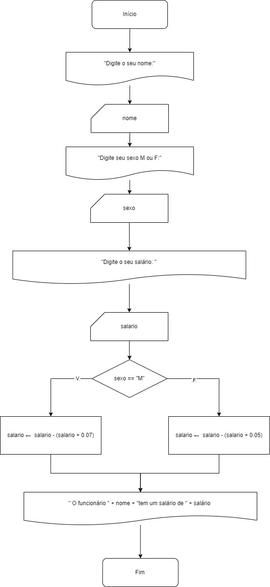
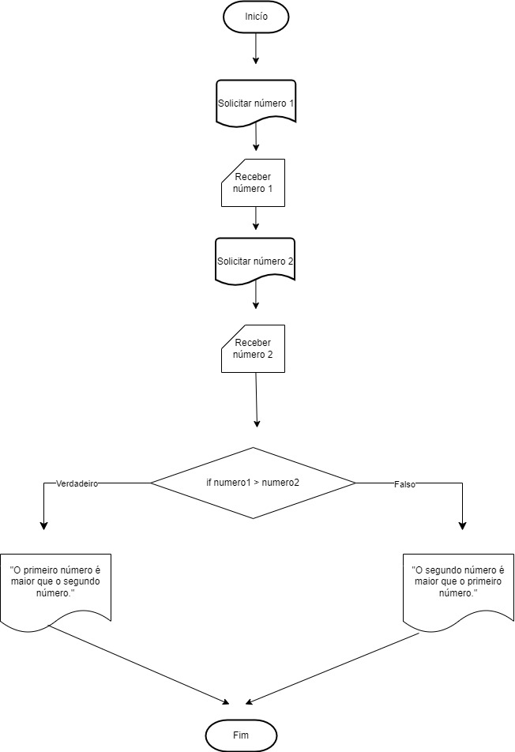
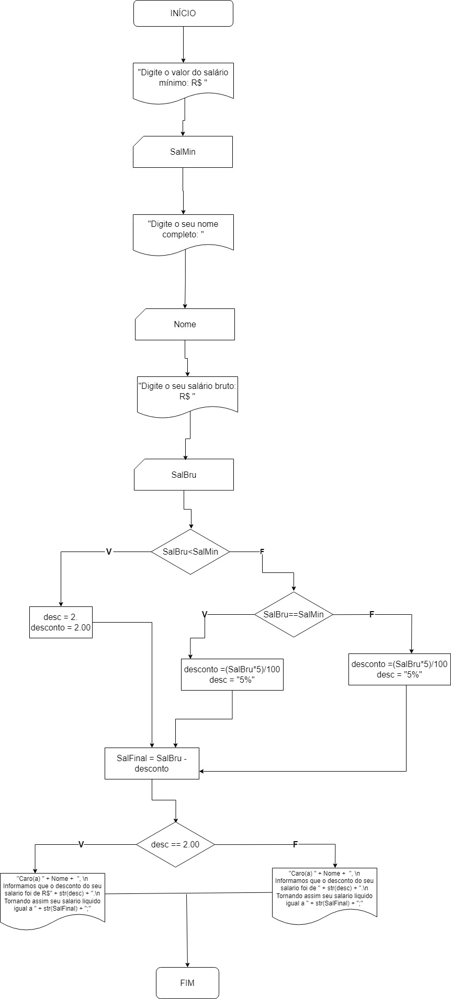
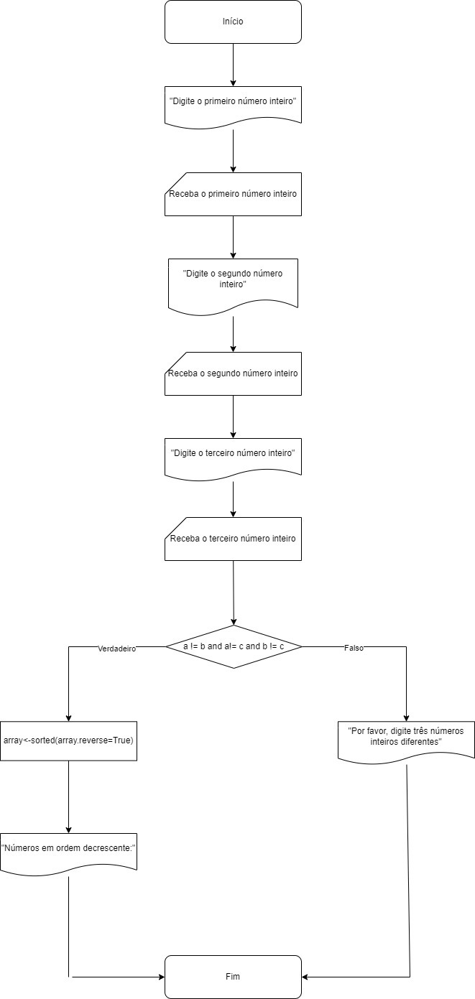
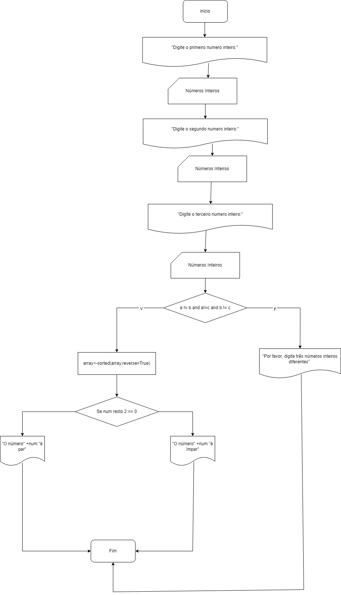

# Semana 1


## Enunciado da questão 1

Crie um programa para solicitar o ano atual e o ano de nascimento de uma pessoa. Calcular sua idade e informa-la. Se sua idade for inferior a 16 anos, escrever a mensagem "Não pode votar."; caso contrário, emitir a mensagem "É eleitor".


```py
calcular_idade = lambda x: x > 16

ano_atual = int(input('Digite o ano atual: '))
print(f"Você digitou que o ano atual é {ano_atual}")
ano_nascimento = int(input('Digite o ano de nascimento: '))
print(f"Você digitou que o ano de nascimento é {ano_nascimento}")

print("Eleitor" if calcular_idade(ano_atual - ano_nascimento) else "Não pode votar")
```

## Enunciado da questão 2

Elabore um programa para solicitar nome, sexo e o salário de um funcionário, descontar 7% do seu salário se for do sexo masculino, caso contrário, descontar 5% informar o valor do desconto e o salário líquido.



```py
class Funcionario:
    def __init__(self,nome:str,sexo:str,salario:float):
        e_homem = lambda x: x == 'M'
        descontar_sete_porcento = lambda x: x - (x * 0.07)
        descontar_cinco_porcento = lambda x: x - (x * 0.05)
        self.nome = nome
        salario = descontar_sete_porcento(salario) if e_homem(sexo) else descontar_cinco_porcento(salario)
        self.salario = salario


funcionario = Funcionario(input("Digite o seu nome: "),input("Digite o seu sexo M ou F: "),int(input("Digite o seu salario: ")))

print(f"O funcionario {funcionario.nome} tem um salario de {funcionario.salario}")
```

## Enunciado da questão 3

Faça um programa que leia dois números e mostre qual o maior dos dois. Considere que são diferentes.


```py
# Solicita os números ao usuário
numero1 = float(input("Digite o primeiro número: "))
numero2 = float(input("Digite o segundo número: "))

# Verifica qual número é maior
if numero1 > numero2:
    print("O primeiro número ({}) é maior que o segundo número ({})".format(numero1, numero2))
else:
    print("O segundo número ({}) é maior que o primeiro número ({})".format(numero2, numero1))
```

## Enunciado da questão 4

Crie um programa que leia dois números e mostre o maior. Se forem iguais, escrever a mensagem "São iguais".



```py
# Solicita os números ao usuário
numero1 = float(input("Digite o primeiro número: "))
numero2 = float(input("Digite o segundo número: "))

# Verifica se os números são iguais
if numero1 == numero2:
    print("Os números são iguais.")
else:
    # Se os números não forem iguais, determina qual é o maior
    if numero1 > numero2:
        print("O primeiro número ({}) é maior que o segundo número ({}).".format(numero1, numero2))
    else:
        print("O segundo número ({}) é maior que o primeiro número ({}).".format(numero2, numero1))
```

## Enunciado da questão 5

Faça um programa para ler o valor do salário mínimo, e o nome e salário bruto de um funcionário. se o salário for menor que um salário mínimo, descontar R$ 2,00; se for igual, descontar 5%, e se for superior, descontar 8%. Informar o valor dos desconto e o salário líquido.



```py
SalMin = float(input("Digite o valor do salário mínimo: R$ "))
print("\n")
Nome = input("Digite o seu nome completo: ")
print("\n")
SalBru = float(input("Digite o seu salário bruto: R$ "))

if SalBru<SalMin:
    desc = 2.
    desconto = 2.00
elif SalBru==SalMin:
    desconto = (SalBru*5)/100
    desc = "5%"
else:
    desconto = (SalBru*8)/100
    desc = "8%"

SalFinal = SalBru - desconto

print("\n")

if desc == 2.00:
    print("Caro(a) " + Nome +  ", \n Informamos que o desconto do seu salario foi de R$" + str(desc) + ".\n Tornando assim seu salario liquido igual a " + str(SalFinal) + ";")
else:
    print("Caro(a) " + Nome +  ", \n Informamos que o desconto do seu salario foi de " + str(desc) + ".\n Tornando assim seu salario liquido igual a " + str(SalFinal) + ";")
```

## Enunciado da questão 6

Elabore um programa que leia três números (diferentes) e informe o maior entre os mesmos.


```py
def main():

    a = int(input('Digite um número: '))
    b = int(input('Digite mais um número: '))
    c = int(input('Digite MAIS UM OUTRO número: '))

    maior = a

    if b > a and b > c:
        maior = b

    if c > a and c > b:
        maior = c

    print(f'O maior número é {maior}')

main()
```

## Enunciado da questão 7

crie um programa para ler três números (diferentes) e imprima-os em ordem decrescente.



```py
a = int(input("Digite o primeiro número inteiro: "))
b = int(input("Digite o segundo número inteiro: "))
c = int(input("Digite o terceiro número inteiro: "))


if a != b and a != c and b != c:
    print(f"Números em ordem decrescente: {max(a, b, c)}, {sorted([a, b, c], reverse=True)[1]}, {min(a, b, c)}")
else:
    print("Por favor, digite três números inteiros diferentes.")
```

## Enunciado da questão 8

crie um programa para ler três números (diferentes) e imprima-os em ordem decrescente informando se os mesmos são pares ou impares.



```py
a = int(input("Digite o primeiro número inteiro: "))
b = int(input("Digite o segundo número inteiro: "))
c = int(input("Digite o terceiro número inteiro: "))

if a != b and a != c and b != c:
    print(f"Números em ordem decrescente: {max(a, b, c)}, {sorted([a, b, c], reverse=True)[1]}, {min(a, b, c)}")

    for num in [a, b, c]:
        paridade = "par" if num % 2 == 0 else "ímpar"
        print(f"O número {num} é {paridade}.")

else:
    print("Por favor, digite três números inteiros diferentes.")
```